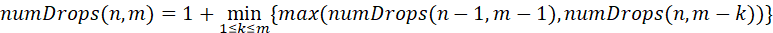

## 问题：一名科学家正在一栋大楼进行一个实验：某种材料的防护性能。他在大楼底部铺下一层这个防护材料，想拿鸡蛋做实验，将鸡蛋从楼层掉下，看看鸡蛋从哪一层掉下去会摔碎，以此测试材料的防护性能。这就是著名的鸡蛋掉落问题（egg dropping problem），即给定N个鸡蛋和M层楼，试问至少需要几次才能确定鸡蛋从哪一层楼掉下去恰好会摔碎。

## 解答思路
为了方便问题的理解以及符合编程语言的特性，我们可以认为存在楼层为0的情况，也存在鸡蛋为0的情况。当楼层为0时，不论提供的鸡蛋数量为多少，需要尝试的次数均为0次。

我们先从最简单的情况入手：
1. 若鸡蛋的数量或者楼层的数量为0，则尝试0次即可；
2. 如果鸡蛋数为1，假如楼层数为k，最坏的情况为尝试k次，即无论以任何楼层顺序尝试摔鸡蛋，都是试到最后一层才把鸡蛋摔烂，因此至少需要k次才能确定鸡蛋从哪一层楼掉下去恰好摔碎。

有了最简单的情况还不够，对于鸡蛋数量为n，楼层数为k的情况，还是比较复杂。此时我们可以考虑使用动画规划的思想来解决，假设用numberDrop(n, m)表示该问题的解，则将鸡蛋从k层楼扔下，有以下两种情形：
1. 鸡蛋摔碎了。此时剩下n-1个鸡蛋，需要考虑比k低的楼层，即1，2，。。。，k-1层。这个问题被缩减为求解numberDrop(n-1, k-1)。
2. 鸡蛋没有摔碎。此时还剩下n个鸡蛋，需要考虑比k高的楼层，即k+1， k+2，。。。，m层，共有m - k层。这个问题被缩减为求解numberDrop(n, m - k)。

对于以上两种情形，因为要考虑最坏情况下的尝试，应该取两种尝试次数的最大值。同时，考虑到k可能为1到m之间的任意一个楼层，得出如下求解公示：

结合以上，我们就可以用动态规划对该问题进行求解了，swift版本的代码如下：
~~~
import Foundation

/// 解决扔鸡蛋问题-动画规划方式
/// - Parameters:
///   - eggCounts: 可以使用的鸡蛋数量
///   - floorCounts: 需要测试的楼层数
/// - Returns: 至少需要尝试的次数（最坏情况）
public func solveEggQuesiton(eggCounts: Int, floorCounts: Int) -> Int {
    /// 用一个二维数组来存储特定鸡蛋数n和特定楼层数m时所至少需要尝试次数，因为考虑了鸡蛋和楼层为0的情况，所以需要+1，刚开始的默认值均为-1，代表未计算过某一情况的最少尝试次数
    var numberDrop: [[Int]] = Array<Array<Int>>(repeating: Array<Int>(repeating: -1, count: floorCounts + 1), count: eggCounts + 1)
    for eggCount in 0...eggCounts {
        // 楼层为0
        numberDrop[eggCount][0] = 0
        // 楼层为1
        numberDrop[eggCount][1] = 1
    }
    for floor in 0...floorCounts {
        // 鸡蛋数量为0
        numberDrop[0][floor] = 0
        // 鸡蛋数量为1
        numberDrop[1][floor] = floor
    }
    print("当前已确定最少尝试次数的鸡蛋楼层组合为\(numberDrop)")
    for eggCount in 2...eggCounts {
        for floorCount in 2...floorCounts {
            //在计算某一个特定情形的尝试次数时，把默认值改为最大
            numberDrop[eggCount][floorCount] = Int.max
            // 开始计算鸡蛋数量为eggCount，楼层数为floorCount的最少尝试次数
            for initialSelectedBeginFloor in 1...floorCount {
                
                let currentMax = max(numberDrop[eggCount - 1][initialSelectedBeginFloor - 1] + 1, numberDrop[eggCount][floorCount - initialSelectedBeginFloor] + 1)
                if currentMax < numberDrop[eggCount][floorCount] {
                    numberDrop[eggCount][floorCount] = currentMax
                }
                print("当前数组中的值为\(numberDrop)")
            }
            // 鸡蛋数量为eggCount，楼层数为floorCount的最少尝试次数已经计算完毕，后续循环的计算都是基于现在及之前计算好的确定值
            print("\(eggCount)个鸡蛋\(floorCount)层楼的情况已经计算完毕-------------\n")
        }
    }
    return numberDrop[eggCounts][floorCounts]
}

solveEggQuesiton(eggCounts: 2, floorCounts: 10)
~~~
